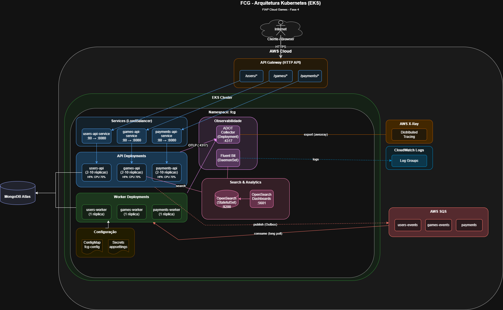
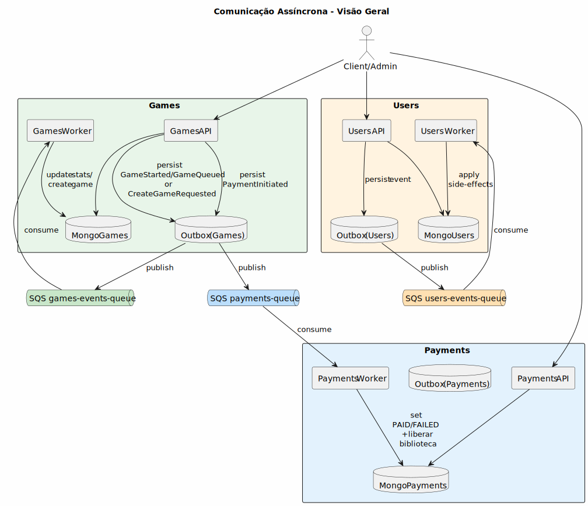
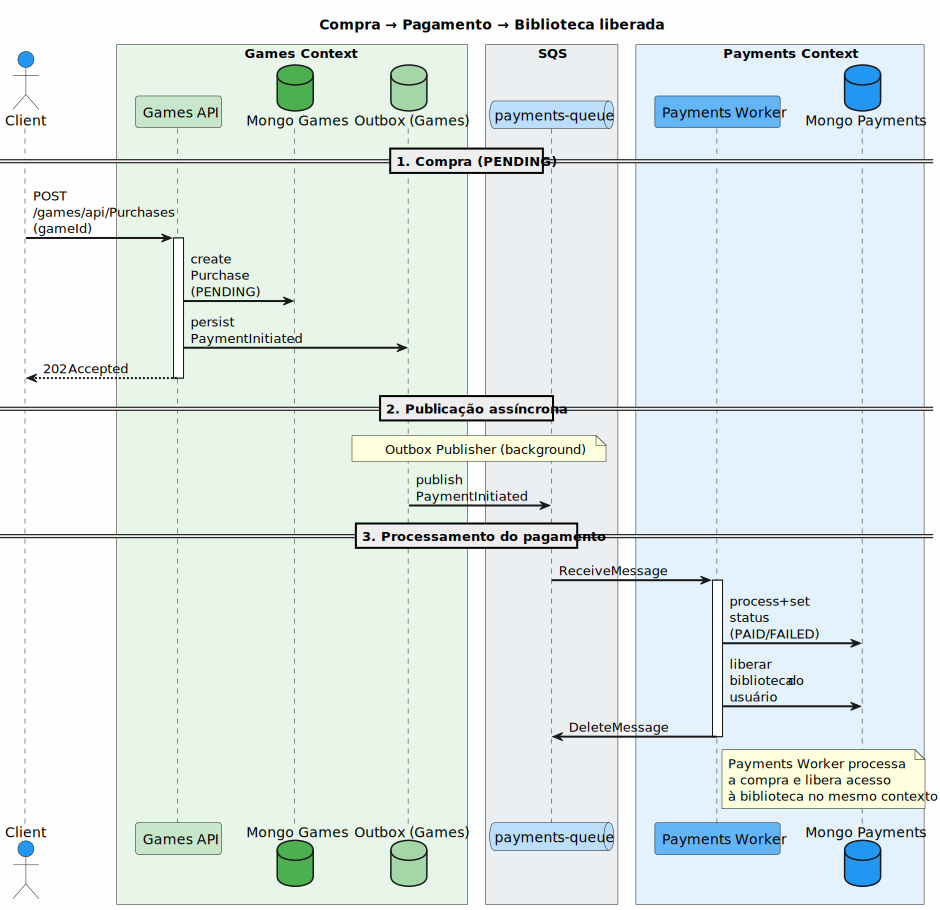
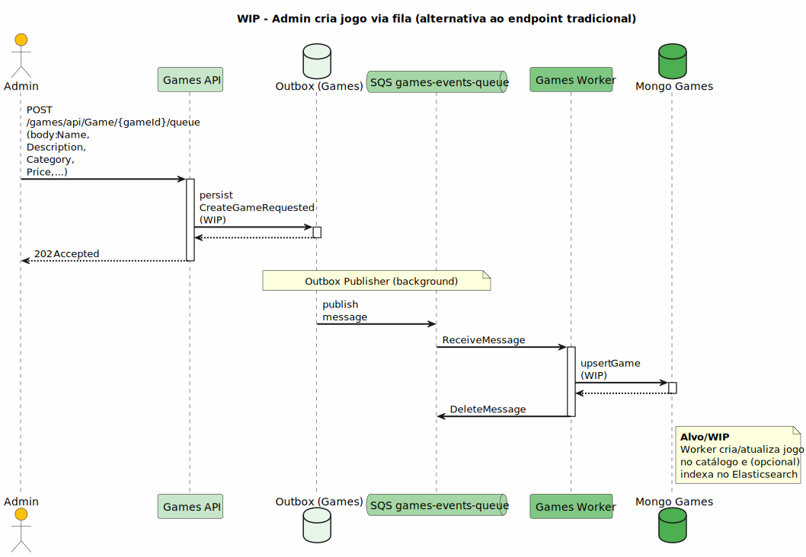

# FIAP Cloud Games (FCG)

## 1) Visão geral

- Microsserviços: **users**, **games**, **payments**
- Entrada única: **API Gateway (HTTP API)**
- Async: **SQS** (publish/consume via **Workers**) — 3 filas / 3 workers
- Orquestração e escala: **Kubernetes + HPA (metrics-server)**
- Observabilidade:
  - **Logs**: Fluent Bit → **OpenSearch (in-cluster)** + **CloudWatch Logs**
  - **Tracing**: OpenTelemetry → ADOT Collector → **AWS X-Ray**

---

## 2) Arquitetura no Kubernetes (visão geral)

---

## 3) Kubernetes + HPA (onde está a escala)

- Deployments separados por contexto:
  - **users-api / users-worker**
  - **games-api / games-worker**
  - **payments-api / payments-worker**
- **Services LoadBalancer** para expor as APIs (por trás do API Gateway)
- **HPA** escalando as **APIs** (CPU/memória)

---

## 4) Comunicação assíncrona (SQS) — visão alto nível

- APIs publicam eventos via **Outbox**
- Workers fazem **polling/consume/delete** no SQS

---

## 5) Fluxo principal da demo: Compra → Pagamento → Biblioteca

- `POST /games/api/Purchases` cria Purchase (PENDING) e publica `PaymentInitiated`
- Payments Worker processa e atualiza status (PAID/FAILED) e libera acesso

---

## 6) Fluxo alternativo: Admin cria jogo via fila (event-driven)

- Exemplo de operação administrativa orientada a eventos (mesmo padrão: API → Outbox → SQS → Worker)

---

## 7) Observabilidade (Logs + Tracing)

- **Logs**: Fluent Bit coleta logs de todos os pods
  - OpenSearch Dashboards (Discover) para filtro/busca
  - CloudWatch Logs como evidência no Console AWS
- **Tracing**: OTLP → ADOT Collector → X-Ray
  - Service map com APIs + Workers

---

## 8) Demo (fluxo rápido)

1. Health via API Gateway: `/users/health`, `/games/health`, `/payments/health`
2. Login → obter JWT
3. Criar compra: `POST /games/api/Purchases` com `{ gameId }`
4. Acompanhar pagamento: `GET /payments/api/payments/{purchaseId}`
5. Biblioteca: `GET /games/api/Purchases/library`
6. Logs no OpenSearch (Discover) + um recorte no CloudWatch
7. Tracing no X-Ray
